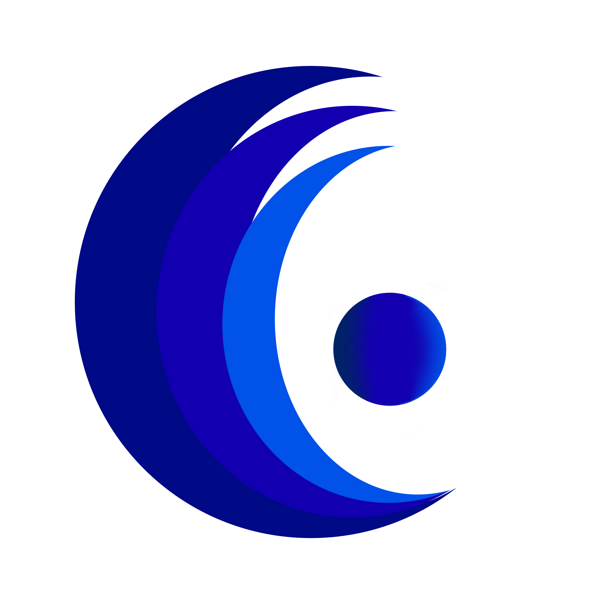



  

# Kakolookiyam 

*Connected together. Invisible to the rest.*

A lightweight, high-performance, and ultra-secure cross-platform peer-to-peer (P2P "Full Mesh") communication application. Built natively in Rust without web technologies to ensure maximum performance and absolute user data privacy.

*Supports: Windows, macOS, Linux | Languages: English, Français, العربية (Arabic)*

## Security & Architecture Philosophy (Zero-Knowledge)

This project adopts a strict **zero-trust, zero-trace** design:

* **Swiss-Fortified Infrastructure:** Our WSS Signaling relies on TLS 1.3 reverse-proxying routed strictly over a sovereign Swiss `.ch` domain with full WHOIS privacy, guarding against metadata harvesting.
* **No Network Persistence:** The blind signaling server and our private, self-hosted Zero-Trace TURN relay handle initial connection matching and NAT traversal anonymously without recording IP addresses or metadata. This completely severs reliance on Big Tech infrastructure (like Google STUN), guaranteeing that your IP addresses are never logged by third parties.

* **Local Vault & Anti-Attack:** Your identity, contacts, and logs are encrypted locally using **ChaCha20Poly1305** and **Argon2id** (OWASP 2026 hardened: 64MB RAM, 3 iterations) to mathematically defeat GPU brute-forcing. The vault uses atomic writes to prevent corruption.

* **RAM-Only Processing & mlock:** Sensitive data resides strictly in temporary memory. Passwords use `SecretString` for immediate auto-zeroization, and private keys are pinned in RAM via `mlock` (`region::lock`) to prevent OS paging to disk (`pagefile.sys`).

* **Local AI Noise Cancellation:** Crystal clear voice communication is achieved using a recurrent neural network (RNNoise) running strictly in RAM on your machine. Zero audio data is sent to external servers, staying true to our philosophy.

* **End-to-End Encryption (E2EE):** All direct P2P streams and heavy file transfers (chunked with ACK) are strictly encrypted.

## Technology Stack

* **Language:** **Rust** - Chosen for extreme performance, zero garbage collector, and absolute memory safety.
* **User Interface (GUI):** **Iced** - Provides a streamlined, native interface.
* **Networking & P2P:** **Tokio** (async) and **WebRTC** (native P2P mesh network, audio, and NAT traversal).

## Credits
Special thanks to **Constance Persad** for the design of the Kakolookiyam logo.

## License & Independence

Kakolookiyam is proudly open-source and distributed under the **GNU Affero General Public License v3.0 (AGPLv3)**. This guarantees that the network architecture remains transparent, auditable, and fiercely protected against proprietary corporate appropriation.

## 💛 Support the Project
If this tool guarantees your digital freedom, consider supporting its independent development:
🎁 **[Sponsor Altayr on GitHub](https://github.com/sponsors/AItayr)**

---

  

# Kakolookiyam

*Connectés entre vous. Invisibles pour le reste.*

Une application de communication pair-à-pair (P2P "Full Mesh") multiplateforme, légère et ultra-sécurisée. Conçue entièrement en natif avec Rust, sans technologies web, pour garantir des performances maximales et une confidentialité absolue.

*Compatibilité : Windows, macOS, Linux | Langues : Anglais, Français, Arabe (العربية)*

## Philosophie de Sécurité (Zero-Knowledge)

Ce projet adopte une architecture stricte **zéro-confiance, zéro-trace** :

* **Infrastructure WSS Suisse :** Le serveur de signalisation bénéficie d'un Reverse-Proxy TLS 1.3 ancré sur un domaine souverain suisse (`.ch` avec annuaire Whois anonymisé).
* **Aucune persistance réseau :** Le serveur de signalisation aveugle et notre propre relais privé TURN (Zéro-Trace) gèrent la mise en relation et le franchissement des NAT de manière anonyme. Cela élimine purement et simplement toute dépendance aux serveurs mondiaux des géants de la tech (comme le STUN de Google), empêchant toute collecte technique (logs) de vos adresses IP en arrière-plan.

* **Coffre-fort local & Anti-Force-Brute :** Protégée par **ChaCha20Poly1305** et **Argon2id** (Normes OWASP 2026 : 64Mo RAM, 3 itérations), votre clé est mathématiquement immunisée contre les attaques GPU offlines. Les écritures sont atomiques pour éviter la corruption.

* **Traitement exclusif en RAM & mlock :** Aucun passage par le disque dur ou le `pagefile.sys`. Les mots de passe sont détruits instantanément (`secrecy`/`zeroize`) et les clés privées cryptographiques sont scellées en mémoire vive (`region::lock`).

* **Annulation de Bruit IA en Local :** Une clarté vocale parfaite est obtenue grâce à un réseau de neurones (RNNoise) s'exécutant strictement en RAM sur votre machine. Aucune donnée audio n'est envoyée à des serveurs externes, contrairement aux solutions tierces classiques.

* **Chiffrement de bout en bout (E2EE) :** Tous les flux P2P directs et les transferts de fichiers lourds sont strictement chiffrés.

## Stack Technique

* **Langage :** **Rust** - Choisi pour ses performances extrêmes, l'absence de garbage collector et sa sécurité mémoire absolue.
* **Interface Graphique (GUI) :** **Iced** - Offre une interface native et fluide.
* **Réseau & P2P :** **Tokio** (asynchrone) et **WebRTC** (réseau maillé P2P natif, audio et franchissement NAT).

## Crédits
Un remerciement tout particulier à **Constance Persad** pour la création et le design du logo Kakolookiyam.

## Licence & Indépendance

Kakolookiyam est open-source et distribué sous la **GNU Affero General Public License v3.0 (AGPLv3)**. Cela garantit que l'architecture réseau reste transparente, auditable et fermement protégée contre toute appropriation commerciale propriétaire.

## 💛 Soutenir le Projet
Si cet outil garantit votre liberté numérique, soutenez son développement indépendant :
🎁 **[Sponsoriser Altayr sur GitHub](https://github.com/sponsors/AItayr)**

---

  

# Kakolookiyam (كاكولوكيام)

*متصلون معاً. مخفيون عن الباقين.*

تطبيق اتصال مباشر من نظير إلى نظير (P2P "Full Mesh") عبر منصات متعددة، خفيف الوزن وفائق الاستقرار. تم بناؤه بالكامل بلغة Rust دون تقنيات الويب (Web Technologies) لضمان أقصى درجات الأداء والسرية المطلقة لبيانات المستخدم.

*يدعم: Windows، macOS، Linux | اللغات: الإنجليزية، الفرنسية، العربية*

## فلسفة الأمن والمعمارية (Zero-Knowledge)

يتبنى هذا المشروع تصميماً صارماً يعتمد على **انعدام الثقة وانعدام الأثر (Zero-Trust, Zero-Trace)**:

* **لا أثر على الشبكة:** يتولى خادم الإشارات الأعمى وخادم (TURN) الخاص والآمن التعامل مع طلبات الاتصال الأولية وتجاوز جدار الحماية (NAT) بشكل مجهول دون تسجيل أي عناوين IP أو بيانات وصفية (Metadata). هذا يلغي تماماً الحاجة للاعتماد على خوادم شركات التكنولوجيا الكبرى (مثل Google STUN)، مما يضمن عدم تتبع أي طرف ثالث لعناوين IP الخاصة بكم.

* **الخزنة المحلية:** يتم تشفير هويتك وجهات اتصالك وسجل محادثاتك محلياً باستخدام **ChaCha20Poly1305** و **Argon2**.

* **المعالجة في ذاكرة الوصول العشوائي (RAM) فقط:** تقتصر إقامة البيانات الحساسة ومعاينات الوسائط على الذاكرة المؤقتة، ويتم مسحها فوراً عند قفل الخزنة.

* **إلغاء الضوضاء بالذكاء الاصطناعي محلياً:** يتم تحقيق جودة صوت نقية باستخدام شبكة عصبية (RNNoise) تعمل بشكل صارم في ذاكرة الوصول العشوائي (RAM) على جهازك. لا يتم إرسال أي بيانات صوتية إلى خوادم خارجية، على عكس تقنيات الطرف الثالث.

* **التشفير من النهاية إلى النهاية (E2EE):** يتم تشفير جميع تدفقات P2P المباشرة ونقل الملفات الثقيلة بصرامة تامة.

## التقنيات المستخدمة

* **لغة البرمجة:** **Rust** - اختيرت لأدائها الفائق، انعدام حاوي القمامة (Garbage Collector)، وأمنها المطلق للذاكرة.
* **واجهة المستخدم (GUI):** **Iced** - يوفر واجهة أصلية وسلسة.
* **الشبكات و P2P:** **Tokio** للبرمجة غير المتزامنة و **WebRTC** لاتصالات P2P والصوت وتخطي شبكات NAT.

## شكر وتقدير
شكر خاص لـ **Constance Persad** على تصميم شعار Kakolookiyam.

## الترخيص والاستقلالية

Kakolookiyam فخور بكونه مفتوح المصدر ويوزع تحت ترخيص **GNU Affero General Public License v3.0 (AGPLv3)**. يضمن ذلك بقاء معمارية الشبكة شفافة وقابلة للتدقيق ومحمية بشراسة ضد أي احتكار تجاري.

## 💛 ادعم المشروع
إذا كان هذا البرنامج يضمن لك حريتك الرقمية، فكر في دعم تطويره المستقل:
🎁 **[دعم Altayr على GitHub](https://github.com/sponsors/AItayr)**
